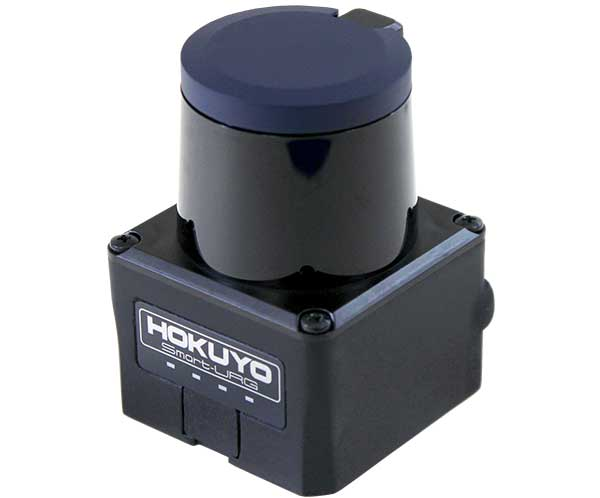

Hokuyo UST20-LX
===============

Safety
------

|

Item Numbers
------------

.. list-table::
   :widths: 80 40 60
   :header-rows: 1
   
   * - Description
     - CPR item
     - Manufacturer item

   * - 
     - 
     - 

 
|

Specifications
--------------

|

Overview
^^^^^^^^

.. list-table::
   :widths: 100 100
   :header-rows: 1
   
   * - Description
     - Value

   * - Mass
     - 

   * - Voltage, Minimum
     - 

   * - Voltage, Maximum
     - 

   * - Voltage, Sensor
     - 

   * - Power, Average
     - 

   * - Data
     - 

   * - Range, Minimum
     - 

   * - Range, Maximum
     - 

   * - Range, Accuracy
     - 

   * - View, Horizontal
     - 

   * - View, Vertical
     - 

   * - Resolution, Horizontal
     - 

   * - Resolution, Vertical
     - 

|

IP addresses
^^^^^^^^^^^^

.. list-table::
   :widths: 100 100
   :header-rows: 1
   
   * - Description
     - IP address

   * - 
     - 

|

Pinout
^^^^^^

.. list-table::
   :widths: 100 100 100
   :header-rows: 1
   
   * - Pin
     - Description
     - Wire colour

   * - 
     - 
     - 

|

Hardware Build
--------------

|

Parts List
^^^^^^^^^^

The PACS kit for this sensor includes:

.. list-table::
   :widths: 1 8 2 2
   :header-rows: 1
   
   * - ID
     - Description
     - CPR item
     - Quantity

   * - 1
     - Plate—80 X 80, Attachment Interface
     - :download:`026914 <../assets/clearpath_robotics_026914.pdf>`
     - 1

   * - 2
     - Sensor, 
     - 
     - 

..

|

Instructions
^^^^^^^^^^^^

#.  Mount the sensor (ID 2) to the attachment-plate (ID 1) using
    

|

Software Bringup
----------------
..
    TODO remove comment
    .. include:: components/pacs_sensor_software_supported.rst
    .. include:: components/pacs_sensor_software_unsupported.rst

|

Troubleshooting
---------------

==============================================  =======================================================================================================================
Issue                                           Troubleshooting steps
==============================================  =======================================================================================================================
Sensor is not turning on                        
                                                #. 
Cannot ping the sensor on the robot's computer  
                                                #. 
Sensor's rostopics are not listed               
                                                #. 
Sensors rostopics don't have any data           
                                                #. 
==============================================  =======================================================================================================================

|

If the issue persists
^^^^^^^^^^^^^^^^^^^^^

.. include:: contact_support.rst

|

Further Reading
---------------

#. 
