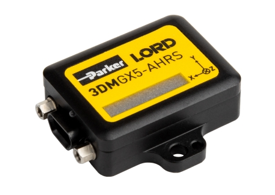

Microstrain 3DM-GX5-25
======================

Safety
------

|

Item Numbers
------------

.. list-table::
   :widths: 80 40 60
   :header-rows: 1
   
   * -  Description
     -  CPR item
     -  Manufacturer item

   * -  Microstrain 3DM-GX5-25 sensor
     -  014603
     -  3DM-GX5-25

   * -  Microstrain 3DM-GX5-25 sensor, PACS kit
     -  027217
     -  

 
|

Specifications
--------------

|

Overview
^^^^^^^^

.. list-table::
   :widths: 100 100
   :header-rows: 1
   
   * - Description
     - Value

   * - Mass
     - 

   * - Voltage, Minimum
     - 

   * - Voltage, Maximum
     - 

   * - Voltage, Sensor
     - 

   * - Power, Average
     - 

   * - Data
     - 

   * - Range, Minimum
     - 

   * - Range, Maximum
     - 

   * - Range, Accuracy
     - 

   * - View, Horizontal
     - 

   * - View, Vertical
     - 

   * - Resolution, Horizontal
     - 

   * - Resolution, Vertical
     - 

|

IP addresses
^^^^^^^^^^^^

.. list-table::
   :widths: 100 100
   :header-rows: 1
   
   * - Description
     - IP address

   * - 
     - 

|

Pinout
^^^^^^

.. list-table::
   :widths: 100 100 100
   :header-rows: 1
   
   * - Pin
     - Description
     - Wire colour

   * - 
     - 
     - 

|

Hardware Build
--------------

|

Parts List
^^^^^^^^^^

The PACS kit for this sensor includes:

.. list-table::
    :widths: 1 8 2 2
    :header-rows: 1
   
    * - ID
      - Description
      - CPR item
      - Quantity

    * - 1
      - Plate—80 X 80, Attachment Interface
      - :download:`026914 <../assets/clearpath_robotics_026914.pdf>`
      - 1

    * - 2
      - Sensor, IMU—Lord Microstrain, 3DM-GX5-25
      - :download:`014603 <../assets/clearpath_robotics_014603.pdf>`
      - 1

    * - 3
      - Cable—Microstrain 3DM-GX5, USB
      - 017543
      - 1

    * - 4
      - Screw, Cap, Socket Head—M3×0.5 X 12, Stainless Steel
      - 023106
      - 2

    * - 5
      - Nut, Hex, Lock—M3×0.5 X 4, Stainless Steel
      - 023705
      - 2

    * - 6
      - Spacer, Round—Ø5.3 X Ø8 X 7, Aluminum Alloy
      - 026612
      - 4

    * - 7
      - Screw, Cap, Round Head—M5×0.8 X 16, Stainless Steel
      - 023257
      - 4 

..

|

Instructions
^^^^^^^^^^^^

#.  Mount the sensor (ID 2) to the attachment-plate (ID 1) using
    

|

Software Bringup
----------------
..
    TODO remove comment
    .. include:: components/pacs_sensor_software_supported.rst
    .. include:: components/pacs_sensor_software_unsupported.rst

|

Troubleshooting
---------------

==============================================  =======================================================================================================================
Issue                                           Troubleshooting steps
==============================================  =======================================================================================================================
Sensor is not turning on                        
                                                #. 
Cannot ping the sensor on the robot's computer  
                                                #. 
Sensor's rostopics are not listed               
                                                #. 
Sensors rostopics don't have any data           
                                                #. 
==============================================  =======================================================================================================================

|

If the issue persists
^^^^^^^^^^^^^^^^^^^^^

.. include:: contact_support.rst

|

Further Reading
---------------

#. 
